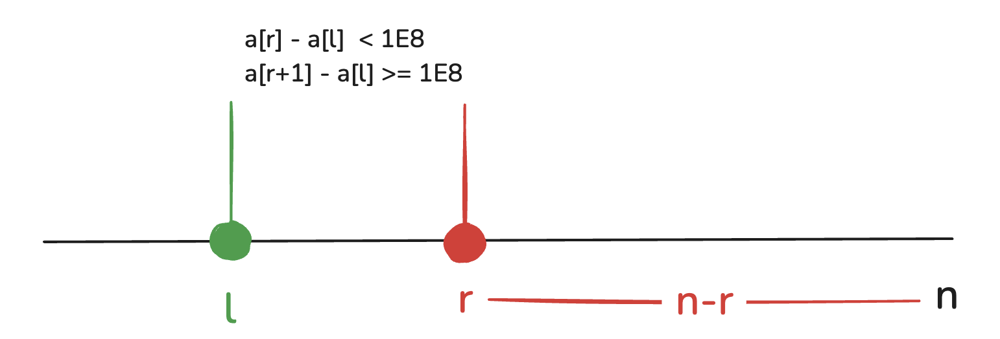

# 2025年03月09日 Div1 场

|     题号      |     难度      | 知识点 |
| :-----------: | :-----------: | :----: |
|       A       | 普及/提高- | 容斥原理 |
|   B           |   普及/提高-  |  前缀和  |

## A题

[题目跳转链接](http://106.55.247.18/p/2736)

### 题目大意

给定 $n$ 个数字 $a_i$，求解$\sum_{i=1}^{n-1} \sum_{j=i+1}^{n}(a_i+a_j) \mod 10^8$。

### 解决思路

#### 法一

显然存在暴力解法，双重循环实现该过程，时间复杂度 $\mathcal{O}(N^2)$。

注意，读入数据较大，需要关闭同比提高读入速度。

<details>
  <summary>查看题解代码</summary>

 ``` cpp
#include <bits/stdc++.h>
using namespace std;

const int p = 1E8;

void solve() {
    int n;
    cin >> n;

    vector<int> a(n + 1, 0);
    for (int i = 1; i <= n; i++) cin >> a[i];
    long long ans = 0;
    for (int i = 1; i < n; i++)
        for (int j = i+1; j <= n; j++)
            ans += (a[i] + a[j]) % p;
        
    cout << ans << '\n';
}

int main() {
    ios::sync_with_stdio(false);
    cin.tie(nullptr);

    int _ = 1;
    // cin >> _;

    while (_--) {
        solve();
    }

    return 0;
}
```
</details>

#### 法二

考虑没有 $10^8$ 这个限制，$\sum_{i=1}^{n-1} \sum_{j=i+1}^{n}(a_i+a_j)$ 可以写成 $(n-1)\sum_{i=1}^{n}a_i$。

把题目中的 $f$ 写成以下形式：
$$
    f(i,j)=
        \begin{cases}
        a_i+a_j,&\text{if  $a_i+a_j < 10^8$}\\
        a_i+a_j - 10^8, &\text{if $a_i + a_j \ge 10^8$}
        \end{cases}
$$

可以发现不论 $a_i + a_j$ 结果如何，都会加上去，区别就在于是否要减去一个 $10^8$，那么问题转化成 $(n-1)\sum_{i=1}^{n}a_i$ 的结果要减去多少个 $10^8$，**即计算$(i,j)(1 \le i < j \le n)$ 中 $a_i +a_j$ 大于等于 $10^8$ 的整数对**。

::: tip 前置题目
该查找点对的方式为[双指针模板题](https://www.luogu.com.cn/problem/U260820)，该法也可以叫滑动窗口。
:::

把数组排序后，对于每一个左端点 $l$，我们都去找到它的最远右端点 $r$，满足 $a_l + a_r < 10^8, a_l + a_{r+1} \ge 10^8$，那么对于该左端点就会为答案贡献 $n-r$ 个 $10^8$ 次，具体如图所示。




<details>
  <summary>查看题解代码</summary>

``` cpp
#include <bits/stdc++.h>
using namespace std;
using ll = long long;

int main() {
  int n;
  cin >> n;
  vector<int> a(n);
  for(auto &v : a) cin >> v;
  sort(a.begin(), a.end());
  int r = n;
  ll cnt = 0, res = 0;
  for(int i = 0; i < n; i++) {
    r = max(r, i + 1);
    while(r - 1 > i and a[r - 1] + a[i] >= 100000000) {
      r--;
    }
    cnt += n - r;
  }
  for(int i = 0; i < n; i++) res += ll(a[i]) * (n - 1);
  res -= cnt * 100000000;
  cout << res << endl;
}
```
</details>

#### 法三

该方法从法二中推导而来，核心是<sapn class="marker-evy">空间换时间</sapn>。

创建一个大小为 $10^8$ 次的数组 $cnt$，统计每个数字出现的次数。对 $cnt$ 数组做一次前缀和，即可 $\mathcal{O}(1)$ 查询某段区间内所有数字的出现次数。

对于 $a_i+a_j \ge 10^8$ 的整数对查询，即可通过 $n - cnt[10^8 - a_i -1]$ 得到，这里需要注意，如果 $2 \times a_i \ge 10^8$ 需要单独减去 $1$，因为 $a_i$ 被重复统计了。

例如当 $a_i = 10^7$，那么计算的就是 $n - cnt[10^8 - 10^7 - 1]$ 的个数，显然会包含 $10^7$ 这个点本身。

假设统计结果放在变量$tot$，答案就是 $(n-1)\sum_{i=1}^n a_i - tot / 2 * 10^8$。

<details>
    <summary>查看题解代码</summary>

```cpp
#include <cstdio>
#include <algorithm>
#include <cmath>
#include <vector>

using namespace std;

const int p = 1E8;

void solve() {
	int n;
	scanf("%d",&n);
	
	vector<int> a(n + 1, 0);
	long long s = 0;
	for (int i = 1; i <= n; i++) {
		scanf("%d", &a[i]);
		s += a[i];
	}


	vector<int> cnt(p + 1, 0);
	for (int i = 1; i <= n; i++) {
		cnt[a[i]]++;
	}
	for (int i = 1; i <= p; i++) cnt[i] += cnt[i-1];
	
	
	long long ans = 0;
	for (int i = 1; i <= n; i++) {
		ans += n - cnt[p - a[i] - 1];
		if (1LL * a[i] * 2 >= p) {
			--ans;
		}
	}
	printf("%lld\n", (n-1) * s - ans / 2 * p);
}


int main() {
	int _ = 1;
	while (_--) {
		solve();
	}
	return 0;
}
```

</details>


## B题

[题目跳转链接](http://106.55.247.18/p/2737)

### 题目大意

给定 $n$ 个数字 $a_i$，求解$\sum_{i=1}^{n-1} \sum_{j=i+1}^{n}(a_i+a_j) \mod 998244353$。

$f$ 定义如题所示。

### 解决思路

#### 法一

暴力略，常见的优化思路是考虑如何消掉一个 $\sum$（直接计算单点贡献或者加速查找的过程）。

#### 法二

对 $f$ 变形：$f(i,j) = 10^{len(a_j)} \times a_i + a_j$，其中 $len$ 表示数字长度。

设 $len$ 表示数字长度，可以做如下推导：
$$
\begin{align}
\sum_{i=1}^{n-1} \sum_{j=i+1}^{n}(a_i+a_j) &= \sum_{i=1}^{n-1} \sum_{j=i+1}^{n}a_i^{len(a_i)} \times + a_j \\
&= \sum_{i=1}^{n-1}a_i \times \sum_{j=i+1}^{n} len(a_i) + \sum_{j=i+1}^{n}a_j
\end{align}
$$

如果不能理解，来考虑每个 $a_i$ 的贡献：
- 形同 $f(a_j,a_i)$ 的形式，$a_i$ 对答案的贡献为 $i-1 \times a_i$ 
- 形同 $f(a_i, a_j)$ 的形式，$a_i$ 的贡献为 $\sum_{k=1}^{10}d_k \times 10^k \times a_i$，其中$d_k$ 是长度为 $k$ 且 $j > i$ 的数字个数

<details>
  <summary>查看题解代码</summary>

::: code-group
```cpp[两个前缀和统计]
#include <bits/stdc++.h>
using namespace std;
typedef long long ll;
const ll mod = 998244353;
const int N = 3e5 + 5;
ll n, a[N], b[N], c[N], ans;
ll getw(ll x) {
    ll res = 1;
    while (x) res *= 10, res %= mod, x /= 10;
    return res;
}
int main() {
    cin >> n;
    for (int i = 1; i <= n; i ++) cin >> a[i];
    for (int i = n; i >= 1; i --) {
        b[i] = b[i + 1] + a[i], b[i] %= mod;
        c[i] = c[i + 1] + getw(a[i]), c[i] %= mod;
    } 
    for (int i = 1; i < n; i ++) 
        ans += b[i + 1] + a[i] * c[i + 1] % mod, ans %= mod;
    cout << ans << endl;
    return 0;
}
```

```cpp[倒叙遍历]
#include <bits/stdc++.h>
using namespace std;
#define ll long long
const int mod = 998244353;
ll a[200010];
ll mpow(ll x, ll y) { ll ret = 1; for (int i = 1; i <= y; i++) ret *= x, ret %= mod; return ret; }

int main()
{
	int n; ll tmp = 0, ret = 0; scanf("%d", &n);
	for (int i = 1; i <= n; i++) scanf("%lld", &a[i]);
	for (int i = n; i >= 1; i--)
	{
//		printf("%lld %lld\n", a[i], (tmp + i - 1));
		ret += a[i] * (tmp + i - 1), ret %= mod;
//		printf("%lld\n", mpow(10LL, to_string(i).size() + 1));
		tmp += mpow(10LL, to_string(a[i]).size()), tmp %= mod;
	} printf("%lld\n", ret);
	return 0;
}
````

:::
	
</details>
